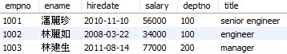

# Data Qurey Language
## 語法順序
***SELECT***<br>
***FROM***<br>
***[WHERE]***<br>
***[GROUP BY]***<br>
***[HAVING]***<br>
***[ORDER BY]***<br>
***[LIMIT]***
## 欄位別名
- SELECT something [AS 別名]
---
## 字串處理
- SUBSTRING(str, idx, len)<br>
  所有的資料庫的index都是從**1**開始
- CONCAT(str1, str2 ...) : 串接字串
  ```
  SELECT CONCAT(fname, ' ',catalog) 'Food name & catalog'
  FROM food;
  ```
  
- LENGTH(str)，回傳值為str所佔的**bytes**數
- CHAR_LENGTH(str)，回傳值為str的**字元**
---
## 時間處理
- SYSDATE()、NOW() - 回傳當下日期與時間
- 同一個SELECT裡的NOW()回傳的時間，都是第一個NOW()的時間
  - 若要在同一個SELECT裡都取得**當下**的日期與時間，可用SYSDATE()
- CURDATE() - 當下日期
- CURTIME() - 當下時間
---
## 去除重複的資料
- SELECT **DISTINCT** dst FROM src;
---
## WHERE

- Get employees whose salary is between 30000 and 50000
  ```
  SELECT * FROM employee WHERE salary BETWEEN 30000 AND 50000;
  ```  
  
- **LIKE** 'pattern' :
  - % : 零至多個字元
  ```
  SELECT * FROM employee WHERE ename LIKE '__麗';
  ```  
  
  - _ : 一個字元
  ```
  SELECT * FROM employee WHERE ename LIKE '__麗';
  ```  
  

---
## ORDER BY
- Get all employees from database, order by salary
  ```
  SELECT * FROM employee ORDER BY salary;
  ```
  
- Get all employees from database, order by salary Descending
  ```
  SELECT * FROM employee ORDER BY salary DESC;
  ```
  
- ORDER BY with alias, notice that the alias after BY **cannot be** surround with ' '
  ```
  SELECT ename, salary*12 'Annual' FROM employee ORDER BY Annual;
  ```
  
- or you can write your code this way, **Recommaned**
  ```
  SELECT ename, salary*12 'Annual' FROM employee ORDER BY salary*12;
  ```
  

---
## LIMIT
- Get the first three employees
  ```
  SELECT * FROM employee LIMIT 3;
  ```
  
- Skip the first three employees, then get the following three employees
  ```
  SELECT * FROM employee LIMIT 3, 3;
  ```
  

---
## Aggregate Function
- Calculate the summary, average, highest, lowest salary out of all employees
  ```
  SELECT	SUM(salary) 'summary',	AVG(salary) 'average',
		    MAX(salary) 'maximum',	MIN(salary) 'minimum'
  FROM employee;
  ```
  

---
## GROUP BY
- Calculate employees count and average salary from different department
  ```
  SELECT	deptno, COUNT(*) 'Count', AVG(salary) 'Average'
  FROM employee
  GROUP BY deptno;
  ```
  
- **HAVING**<br>
  Can only be used after **GROUP BY**, for restricting GROUP BY condition
  ```
  SELECT	deptno, COUNT(*) 'Count', AVG(salary) 'Average'
  FROM employee
  GROUP BY deptno
  HAVING AVG(salary)>50000;
  ```
  

---
## Join
- Find employees and which department they belong to<br>
  **Eqaul(inner) Join**
  ```
  SELECT emp.ename, dept.dname
  FROM emp JOIN dept
  ON emp.deptno = dept.deptno;
  ```
  
- Use alias to replace table name
  - Notice: the alias here **cannot be** bound with ' '
  ```
  SELECT e.ename, d.dname
  FROM emp e JOIN dept d
  ON e.deptno = d.deptno;
  ```
  
- Join with more than two tables
  ```
  SELECT e.ename, d.dname, c.cname
  FROM emp e JOIN dept d
  ON e.deptno = d.deptno
  JOIN city c
  ON d.cityno = c.cityno;
  ```
  

---
## Subquery
>Subquery, also called as inner query or nest query
- Subquery at **WHERE**<br>
  Find all employees whose salary is higher than '潘麗珍'
  ```
  SELECT	ename, salary
  FROM	employee
  WHERE	salary >(SELECT salary
                   FROM	employee
                   WHERE	ename='潘麗珍');
  ```
  
- Subquery at **HAVING**<br>
  Find all departments whose lowest salary is higher than department '200'
  ```
  SELECT    deptno, MIN(salary) 'Minimum Salary'
  FROM	  employee
  GROUP BY  deptno
  HAVING    MIN(salary) > (SELECT MIN(salary)
                           FROM    employee
                           WHERE   deptno = 200);
  ```
  
- Subquery at **SELECT**<br>
  Find the percentage of each employee’s salary at department '100'.
  ```
  SELECT  ename, title, salary,
          ROUND (salary*100/
                (SELECT SUM(salary)
                 FROM   employee
                 WHERE  deptno=100), 1) 'Percentage'
  FROM	employee
  WHERE   deptno = 100;
  ```
  
- Subquery at **FROM**<br>
  Find the percentage of each employee’s salary at department '100'.<br>
  (same question as above, different way to approach)
  ```
  SELECT  ename, title, salary, ROUND(salary*100 / t.total, 1) 'Percentage'
  FROM	employee, (SELECT SUM(salary) 'total'
                     FROM employee
                     WHERE deptno = 100) t
  WHERE   deptno = 100;
  ```
  