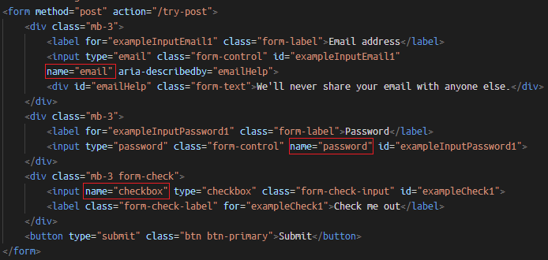
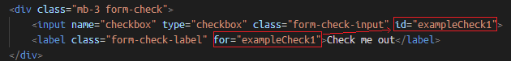
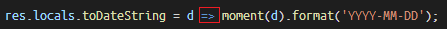
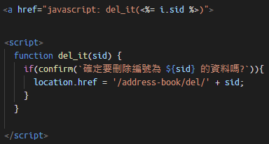

# node.JS

## package.json
- use **npm init -y** to produce package.json

## html post form
- it is required to have **name** attribute inside input tag, otherwise you can't send the data with form
  
- at checkbox tag, set the for attribute could let you check the checkbox by clicking the text of checkbox
  

## arrow function
- 相當於直接return值，回傳給d
- 

## call function with a href tag
- in this case, we use this function to confirm whether to delete the data or not.
- 
